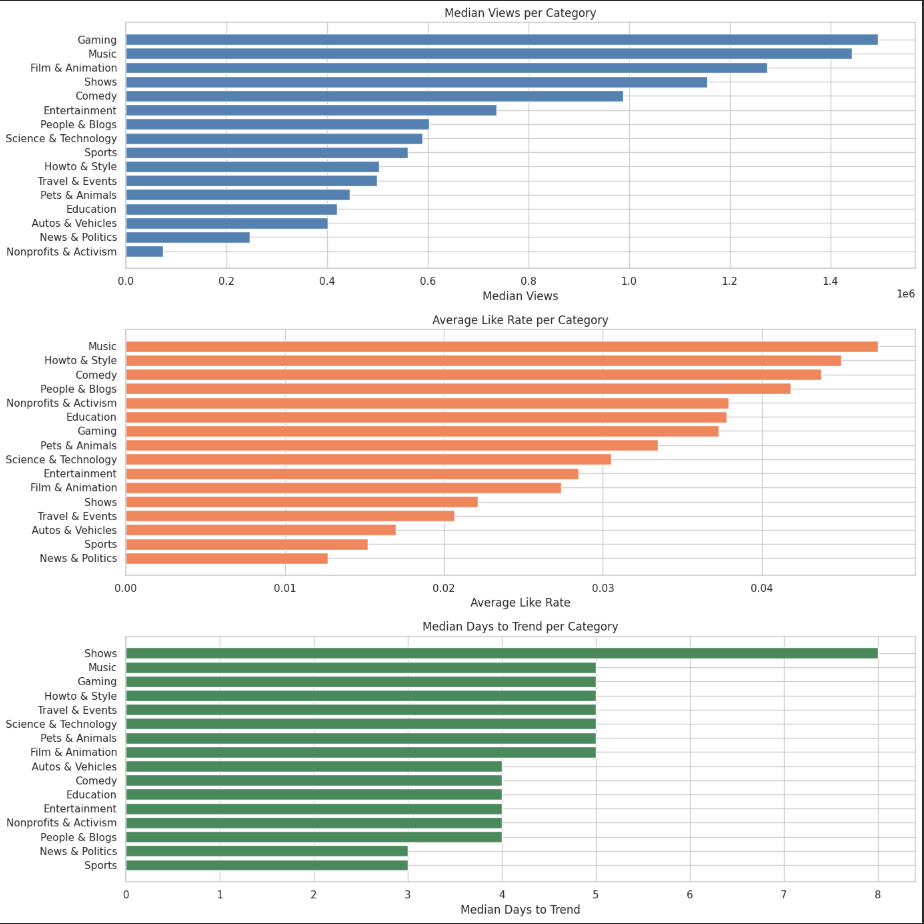
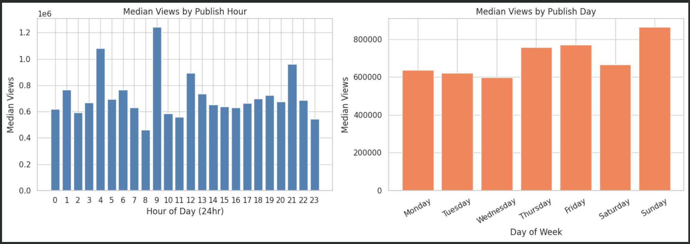
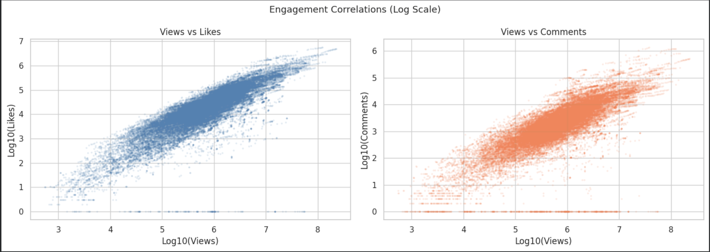

# YouTube Retention Analysis

## Overview
Exploratory data analysis on 40,949 trending YouTube videos 
to identify engagement patterns, optimal publish timing, 
and content strategies across 16 categories.

## Tools & Libraries
Python, Pandas, NumPy, Matplotlib, Seaborn

## Dataset
- 40,949 trending US YouTube videos (2017–2018)
- Source: Kaggle - YouTube Trending Dataset
- Features: views, likes, dislikes, comments, publish time, category

## Methodology
1. Data cleaning & feature engineering
2. Engagement rate calculation (like rate, comment rate)
3. Days to trend analysis
4. Category-level engagement profiling
5. Publishing pattern analysis
6. Composite engagement scoring

## Key Findings
- Sunday 9am is the optimal publish time for maximum views
- Music and Gaming get highest median views (1.4M+) when trending
- Likes have strongest correlation with views (r=0.849)
- BTS/ibighit achieves 20–26% like rate - 8x the platform average
- Most videos trend for 5–7 days; 1,205 videos trended 10+ days

## Key Visuals

## Business Recommendations
- Creators: Publish Sunday 9am, target Music/Gaming categories
- Platform: Gaming is underserved - high views, low promotion
- News & Politics needs engagement features redesign
- Like rate is a better success metric than raw view count
